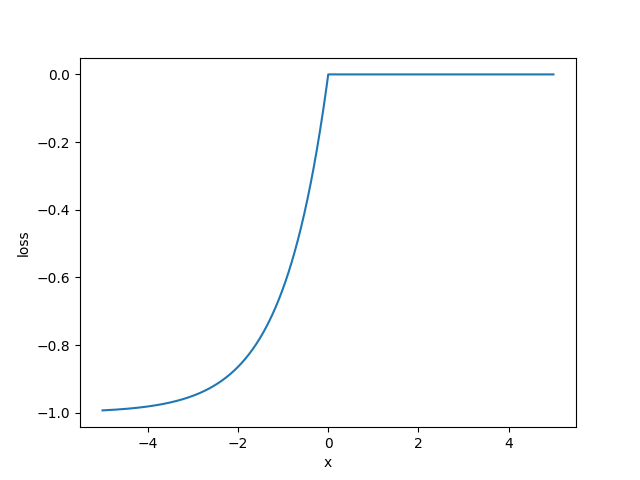

# 架构

# Building
`Building` 建筑物对象，包含多个 `Floor`
# Floor
`Floor` 楼层对象，包含多个 `Room` 和 `Exit`
# Room
`Room` 空间对象，可以表示房间、走廊、楼梯、建筑出口等等
`Room` 中有多个 `Exit` 对象能够通向其他 `Room`
`Room` 中有多个 `Person` 对象
## reduce_rate
`reduce_rate`：`Room` 的人员数量减少速度，是该房间所有 `Exit` 的 `reduce_rate` 的总和
$$
reduce\_rate = \sum_{exits} {exit.reduce\_rate}
$$
## distance
到建筑出口的距离，用 `Dijkstra` 计算
## population
`population`： 该 `Room` 的人数
## area
`area`：该 `Room` 的面积

# Exit
`Exit` 出口对象，表示两个空间之间的连接
具有 `outset` (出发点) 与 `target` (目的地) ，二者都是 `Room` 对象
## reduce_rate 
`reduce_rate`：衡量了某个 `Exit` 对象的通行能力
$$
population = {outset.population+target.population}
$$
$$
area = {outset.area+target.area}
$$
$$
reduce\_rate = 
\begin{cases}
\dfrac {area}{population} \cdot pass\_factor, & \text {target不是建筑出口}\\
1000,& \text {target是建筑出口}
\end{cases}
$$

它与人员密度成反比（待优化），与 `pass_factor`（通行系数）成正比，单位为 `人/帧`，衡量人员通行的能力

# Person
`Person`：人员对象
## room
`room`：当前所在房间
## exits
`exits`：所在房间的 `exits` 属性，即该人员可以选择的所有对象 `Exit` 对象
## position
`position`：该人员的位置 `Position(floor_num, row, col)`
## route
`route` 该人员走过的路线
## P
`P`：从 `exits`  中选择各个 `Exit` 的概率
$$
P_i=
\begin{bmatrix}
p_1 & p_2 &\cdots
\end{bmatrix}
$$
$$
P = normalize(\sum_{i=1}^3 k_i P_i)
$$
$$
\sum_{i=1}^3 k_i = 1
$$
其中：
$P_1$：习惯概率，按照习惯选择各个 `Exit` 的概率。
$P_2$：临场概率。根据现场的通行情况临场决定的选择各个 `Exit` 概率。
$P_3$：距离影响的概率。由到建筑出口的距离决定的选择各个 `Exit` 概率。
$k_i$：$P_i$ 在计算最终的概率分布 $P$ 时所占的权重
$normalize$: 归一化

$P_1$ 的初始化
$$
p_i = \dfrac {1}{exits\_number}
$$
$$
normalize(P_1)
$$
$P_2$ 的计算
$$
p_i = 
\begin{cases}
exit_i.reduce\_rate, & exit_i.target不是楼道或者建筑出口\\
1000, & exit_i.target是楼道或者建筑出口
\end{cases}
$$

$$
normalize(P_2)
$$

$P_3$ 的计算，由于自然界普遍存在吸引力反比于距离二次方，故
$$
distance_i = exit_i.target.distance
$$
$$
p_i = 
\begin{cases}
\dfrac{1}{distance_i^2}, & distance_i>0\\
1\times10^6, & distance_i = 0
\end{cases}
$$
$$
normalize(P_3)
$$
对于 $P_3$，有
$$
\dfrac {p_{i+1}}{p_i}=\dfrac{(d+\Delta d)^2}{d^2}=1 + \dfrac{2 \Delta d}{d} + \dfrac{\Delta d^2}{d^2}
$$
可以看出，若 $\Delta d$ 不变，$d$ 越大，选择两个出口的概率差别越小
即路程较远时，人们往往无法很好衡量远近，以路程为依据决定路线表现出纠结的心理，在模型中表现为选择各个 `Exit` 的可能接近，此时更多地依赖习惯和临场决策，这符合实际情况

# 训练
超参数有：
$lr_0$：学习率
$epoch\_num$：迭代次数
$k_1$：习惯所占权重
$k_2$：临场判断所占权重
$k_3$：距离建筑出口距离所占权重
$\rho$：挥发系数

对 `Building` 中的每个 `Person`，执行以下步骤：
## 1. 判断此人能否转移
$$
\begin{aligned}
\text {if}\quad& 未到达终点 \quad \text{应当转移 else 不应当转移}\\
\\
r &= random()\\
\\
\text {if}\quad r &<\dfrac{room.reduce\_rate}{room.population}\quad \text{应当转移 else 不应当转移}
\end{aligned}
$$
仅当此 `Person` 应当转移时，才执行后续步骤，否则直接处理下一个 `Person`
## 2. 确定 Exit
按上述方法计算该 `Person` 在当前 `Room` 的 `P`
选择 $p_i$ 最大且没有走过的 `Exit` 作为转移的方向 
将此人及其转移方向 (Person, Exit)存入队列
## 3. 执行转移
重复步骤 1. 和 2.，遍历完所有 `Person` 后
从队列中拿出所有(Person, Exit)，执行转移
每将所有人遍历一遍，称为一帧
直到所有 `Person` 都到达了设定的建筑出口 `Room`
## 4. 计算损失
遍历每个 `Person`
`person.cost` 表示某人到建筑出口消耗的帧数
`best` 表示该人在历次迭代中的最少消耗帧数
`output` 表示本次模拟所有人到达建筑出口消耗的帧数
$$
\begin{aligned}
x &= person.cost - best\\
\\
loss &=
\begin{cases}
e^{\frac x 2}-1, & x\le0\\
0, & x>0
\end{cases}
\end{aligned}
$$

损失函数图像为

观察图像，可知，模型会更多地奖励 loss 为负（即 `cost` 小于当前 `best`）的情况，不惩罚 `cost` 大于当前 `best` 的情况
## 5. 更新最优 output
$$
best’ = min(best’, output)
$$
(注：best 的初始值为正无穷)
## 6. 更新 $P_1$
对于每个 `Person`，遍历其途经的 `Exit` ，更新其选择该 `Exit` 的概率
$$
\begin{aligned}
x &= current\_epoch/epoch\_num\\
\\
lr &= (-x^2+x+1) \cdot lr_0\\
\\
p_i &= \rho \cdot p_i - lr\cdot loss\\
\end{aligned}
$$
$$
normalize(P_1)
$$

## 7. 迭代
重置到初始状态
重复 1～6，直到达到设定的迭代次数
得到的 `best` 即为能够反映该建筑疏散能力的指标

